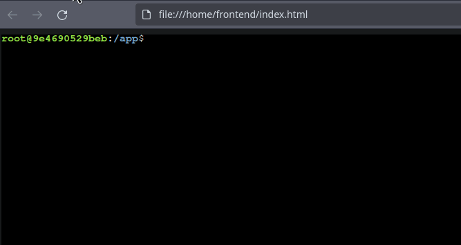

# xterm-server

This is a simple xterm server (written in Rust) that can be used to run xterm **remotely** in a browser.
It is meant to be used as a standalone server.
To connect to the server use the xterm.js library or any other reasonable websocket client.

# Setup

## Running the server

Run the following commands to setup the server:

```bash
git clone
cd xterm-server
docker compose up
```

## Setting the xterm server port

You can set the port that the server listens on by setting the `XTERM_PORT` environment variable. The default port is `8080`.

```bash
docker compose up -e XTERM_PORT=3000
```

# Usage

## With xterm.js

You can connect to the server using the xterm.js library. Here is an example of how you can do this within a browser:

```javascript
import { Terminal } from "xterm";
const ws = new WebSocket("ws://localhost:3000");

const term = new Terminal();
term.open(document.getElementById("terminal"));

term.onData((data) => {
  ws.send(data);
});

ws.onmessage = (event) => {
  term.write(event.data);
};
```

## Without browser

For more minimal usage, you can use tools such as `websockat` or `wscat`:

```bash
websockat ws://localhost:8080
```

# Showcase


